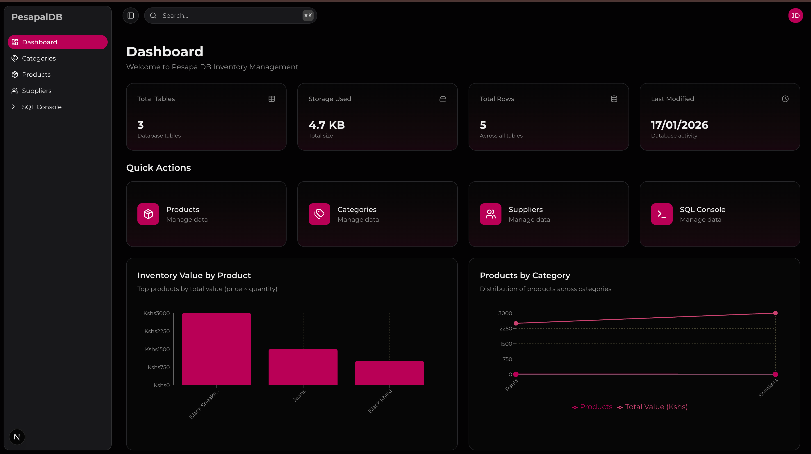
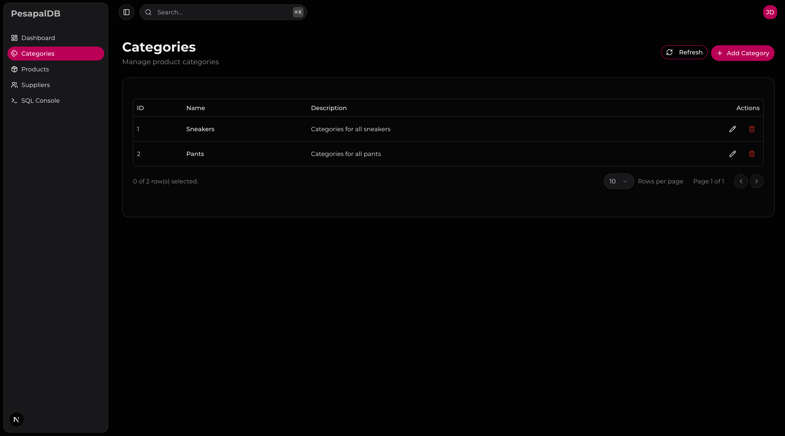
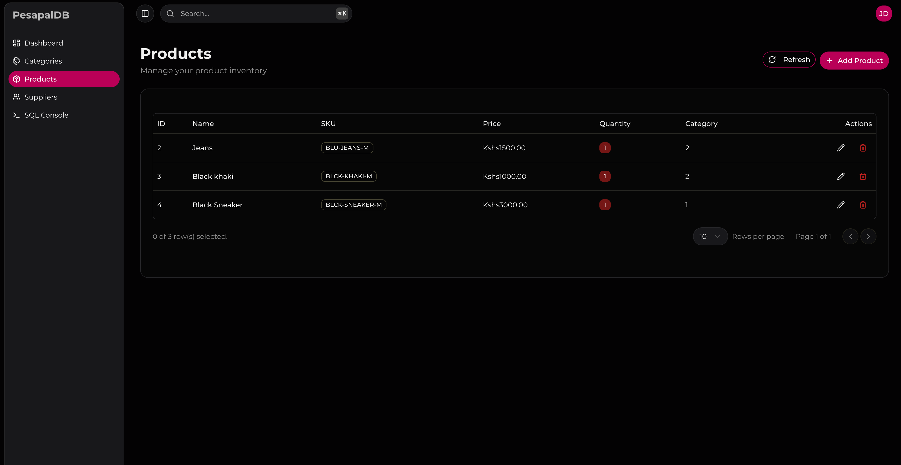
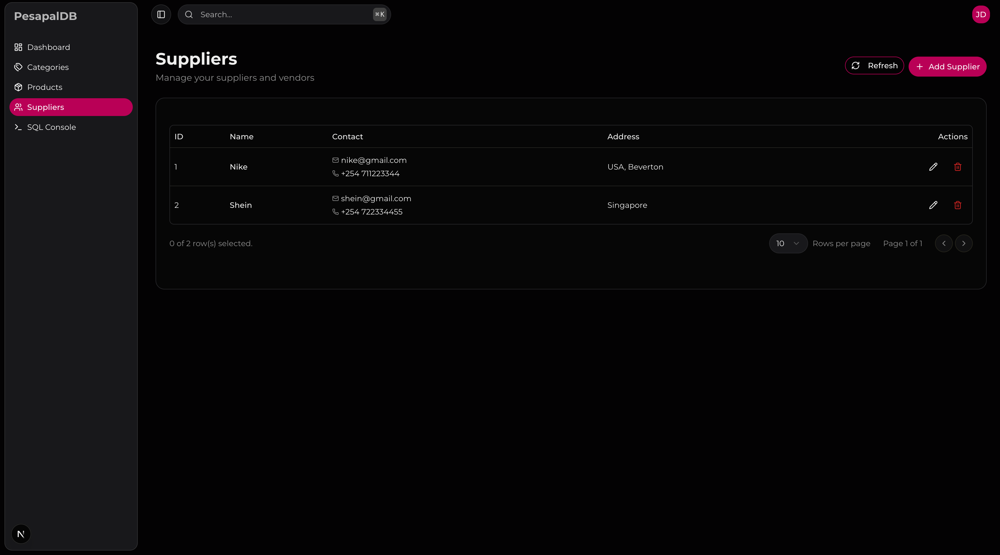
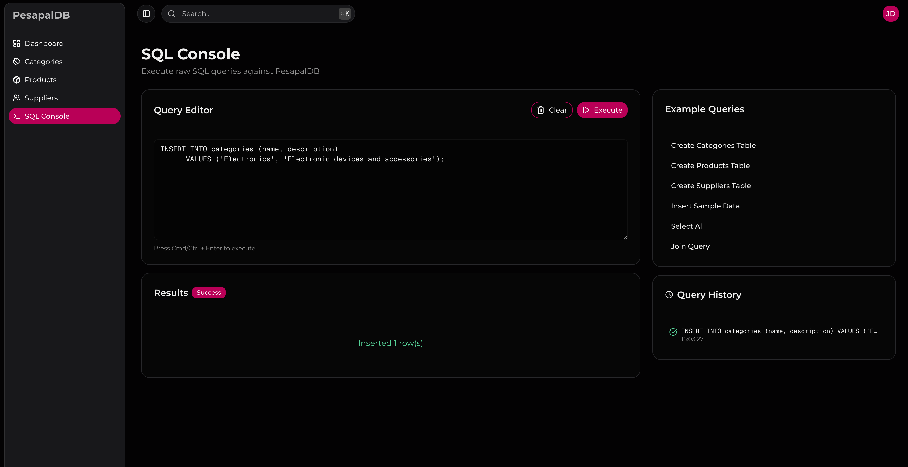
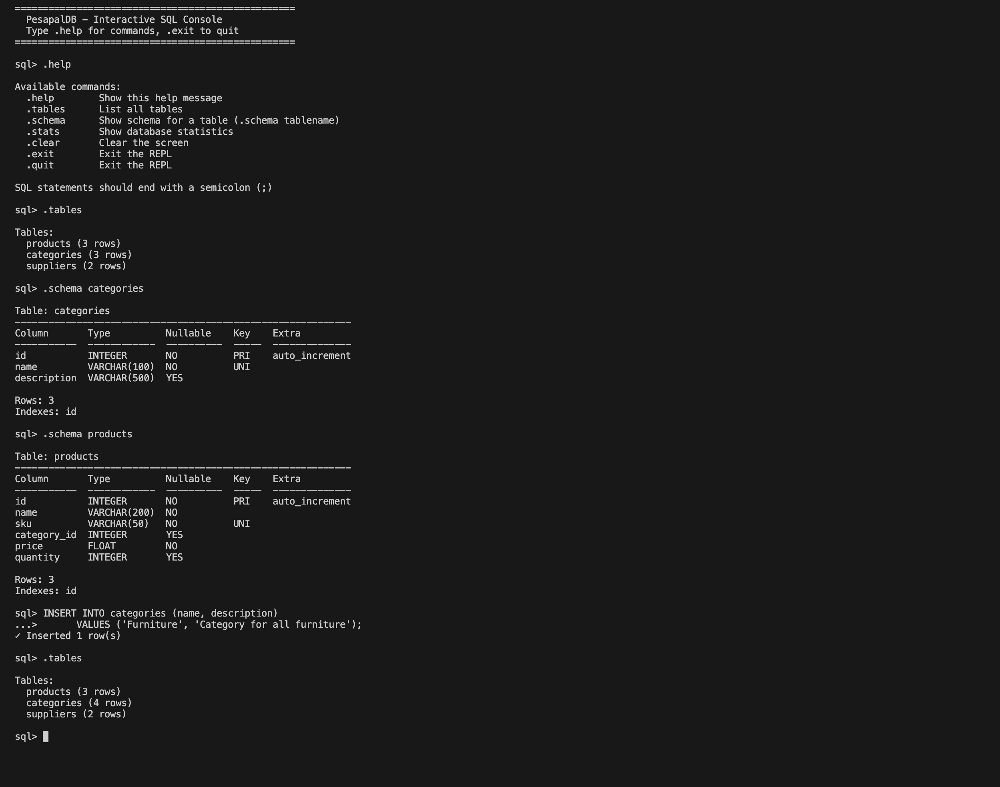

# PesapalDB - A Simple RDBMS Implementation

A custom relational database management system built from scratch for the **Pesapal Junior Developer Challenge 2026**.

## Features

### Core RDBMS Engine

- **SQL Parser**: Full lexer and recursive descent parser supporting SELECT, INSERT, UPDATE, DELETE, CREATE TABLE, DROP TABLE
- **Query Executor**: Handles JOINs, WHERE conditions, ORDER BY, LIMIT, GROUP BY, aggregates
- **Data Types**: INTEGER, FLOAT, VARCHAR, BOOLEAN, DATE, TIMESTAMP
- **Constraints**: PRIMARY KEY, UNIQUE, NOT NULL, FOREIGN KEY references
- **B-Tree Indexing**: Efficient lookups with automatic primary key indexing
- **File-Based Storage**: JSON persistence with schema management

### REST API

- FastAPI-powered REST endpoints
- CRUD operations for all tables
- Raw SQL query execution
- CORS enabled for frontend integration

### Frontend Demo App

- Next.js 15 with TypeScript
- shadcn/ui components with dark glassmorphism theme
- Responsive mobile navigation
- Pages: Dashboard, Products, Categories, Suppliers, SQL Console

### Screenshots













---

## Project Structure

```
pesapal-junior-dev-challenge/
├── backend/
│   ├── .railway/
│   │   └── railway.json
│   ├── api/
│   │   ├── __init__.py
│   │   ├── main.py
│   │   └── models.py
│   ├── rdbms/
│   │   ├── __init__.py
│   │   ├── constraints.py
│   │   ├── engine.py
│   │   ├── indexing.py
│   │   ├── repl.py
│   │   ├── schema.py
│   │   ├── storage.py
│   │   ├── types.py
│   │   ├── executor/
│   │   │   ├── __init__.py
│   │   │   └── executor.py
│   │   └── parser/
│   │       ├── __init__.py
│   │       ├── ast.py
│   │       ├── lexer.py
│   │       └── parser.py
│   ├── Dockerfile
│   └── requirements.txt
└── frontend/
    ├── app/
    │   ├── dashboard/
    │   │   ├── layout.tsx
    │   │   ├── page.tsx
    │   │   ├── categories/
    │   │   │   └── page.tsx
    │   │   ├── products/
    │   │   │   └── page.tsx
    │   │   ├── sql-console/
    │   │   │   └── page.tsx
    │   │   └── suppliers/
    │   │       └── page.tsx
    │   ├── utils/
    │   │   └── store.ts
    │   ├── favicon.ico
    │   ├── globals.css
    │   ├── layout.tsx
    │   └── page.tsx
    ├── components/
    │   ├── data-table/
    │   │   ├── columns.tsx
    │   │   └── data-table.tsx
    │   ├── ui/
    │   │   ├── alert-dialog.tsx
    │   │   ├── alert.tsx
    │   │   ├── avatar.tsx
    │   │   ├── badge.tsx
    │   │   ├── button.tsx
    │   │   ├── card.tsx
    │   │   ├── chart.tsx
    │   │   ├── checkbox.tsx
    │   │   ├── dialog.tsx
    │   │   ├── dropdown-menu.tsx
    │   │   ├── input.tsx
    │   │   ├── interactive-hover-button.tsx
    │   │   ├── label.tsx
    │   │   ├── progress.tsx
    │   │   ├── scroll-area.tsx
    │   │   ├── select.tsx
    │   │   ├── separator.tsx
    │   │   ├── sheet.tsx
    │   │   ├── sidebar.tsx
    │   │   ├── skeleton.tsx
    │   │   ├── sonner.tsx
    │   │   ├── switch.tsx
    │   │   ├── table.tsx
    │   │   ├── tabs.tsx
    │   │   ├── textarea.tsx
    │   │   └── tooltip.tsx
    │   ├── app-sidebar.tsx
    │   ├── theme-provider.tsx
    │   ├── theme-toggle-button.tsx
    │   └── theme-toggle.tsx
    ├── config/
    │   └── nav.ts
    ├── hooks/
    │   └── use-mobile.ts
    ├── lib/
    │   ├── api.ts
    │   └── utils.ts
    ├── public/
    │   ├── file.svg
    │   ├── globe.svg
    │   ├── next.svg
    │   ├── vercel.svg
    │   └── window.svg
    ├── .gitignore
    ├── components.json
    ├── eslint.config.mjs
    ├── next.config.ts
    ├── package-lock.json
    ├── package.json
    ├── postcss.config.mjs
    ├── README.md
    └── tsconfig.json
```

---

## Deployment

The backend is deployed to Railway and is publicly accessible:

-   **API Base URL**: `https://pesapal-junior-dev-challenge-production.up.railway.app`
-   **API Docs**: `https://pesapal-junior-dev-challenge-production.up.railway.app/docs`

---

## Getting Started

### Prerequisites

-   Python 3.9+
-   Node.js 18+
-   npm or yarn

### Backend Setup

```bash
cd backend

# Create virtual environment
python3 -m venv venv
source venv/bin/activate  # On Windows: venv\Scripts\activate

# Install dependencies
pip install -r requirements.txt

# Run the interactive REPL
python3 -m rdbms.repl

# Or start the API server
uvicorn api.main:app --reload
```

The API will be available at `http://localhost:8000`

### Frontend Setup

```bash
cd frontend

# Install dependencies
npm install

# Start development server
npm run dev
```

The frontend will be available at `http://localhost:3000`

---

## Usage

### Interactive REPL

```sql
sql> CREATE TABLE products (
...>   id INTEGER PRIMARY KEY AUTO_INCREMENT,
...>   name VARCHAR(100) NOT NULL,
...>   price FLOAT
...> );
✓ Table 'products' created

sql> INSERT INTO products (name, price) VALUES ('Widget', 29.99);
✓ Inserted 1 row(s)

sql> SELECT * FROM products;
  id  name     price
----  ------  ------
   1  Widget   29.99

1 row(s) returned

sql> .tables
Tables:
  products (1 rows)

sql> .exit
Goodbye!
```

### API Endpoints

| Method | Endpoint                   | Description         |
| ------ | -------------------------- | ------------------- |
| GET    | `/health`                  | Health check        |
| GET    | `/stats`                   | Database statistics |
| POST   | `/query`                   | Execute SQL query   |
| GET    | `/tables`                  | List all tables     |
| GET    | `/tables/{name}`           | Get table info      |
| GET    | `/tables/{name}/rows`      | Get table rows      |
| POST   | `/tables/{name}/rows`      | Insert row          |
| PUT    | `/tables/{name}/rows/{id}` | Update row          |
| DELETE | `/tables/{name}/rows/{id}` | Delete row          |

---

## Supported SQL

### DDL (Data Definition Language)

```sql
CREATE TABLE table_name (
  column_name TYPE [constraints],
  ...
);

DROP TABLE table_name;

CREATE INDEX index_name ON table_name (column_name);
```

### DML (Data Manipulation Language)

```sql
INSERT INTO table_name (col1, col2) VALUES (val1, val2);

UPDATE table_name SET col1 = val1 WHERE condition;

DELETE FROM table_name WHERE condition;

SELECT columns FROM table
  [JOIN other_table ON condition]
  [WHERE condition]
  [GROUP BY columns [HAVING condition]]
  [ORDER BY column [ASC|DESC]]
  [LIMIT n [OFFSET m]];
```

---

## Tech Stack

**Backend:**

-   Python 3.9+
-   FastAPI
-   Pydantic
-   Custom SQL Parser
-   B-Tree Index

**Frontend:**

-   Next.js 15
-   TypeScript
-   Tailwind CSS 4
-   shadcn/ui
-   Lucide Icons

---

## Author

Built by Maureen for the Pesapal Junior Developer Challenge 2026.
